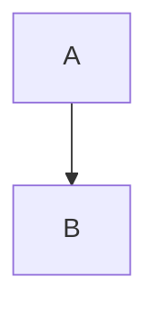

> **Note:** This repository is where I keep my public notes and knowledge that I want to save and publish. It is built and published using [Docusaurus](https://docusaurus.io).

> **Live Site:** [https://aungmyokyaw.github.io/](https://aungmyokyaw.github.io/)

# 📚 meta-knowledge


> **meta-knowledge** is a knowledge management project designed to help you organize, share, and grow your understanding collaboratively.

<details>
	<summary>🗂️ <strong>Table of Contents</strong> (click to expand/collapse)</summary>

</details>

## 📝 About

**meta-knowledge** is my personal knowledge base and public notes repository. Here, I curate, organize, and share information, ideas, and resources that I want to save and publish for myself and others. The site is built and published using [Docusaurus](https://docusaurus.io), making it easy to browse and contribute.

It encourages open learning and creative contribution, while respecting the rights of original authors.

## Enabling Mermaid diagrams (Docusaurus v3)

To render Mermaid diagrams in your Markdown, install the official Mermaid theme and enable Mermaid support in `docusaurus.config.ts`.

Install the theme with your preferred package manager:

```bash
# Using npm
npm install --save @docusaurus/theme-mermaid

# Using yarn
yarn add @docusaurus/theme-mermaid

# Using pnpm
pnpm add @docusaurus/theme-mermaid

# Using bun
bun add @docusaurus/theme-mermaid
```

Then, in `docusaurus.config.ts`, make sure you have:

```ts
markdown: { mermaid: true },
themes: ['@docusaurus/theme-mermaid'],
```

You can now add Mermaid code blocks in Markdown using the `mermaid` language identifier:

````markdown

````

---

## 🛡️ License

This entire project, including all codebase and content, is licensed under the [Creative Commons Attribution-NonCommercial-ShareAlike 4.0 International License (CC BY-NC-SA 4.0)](https://creativecommons.org/licenses/by-nc-sa/4.0/legalcode.en).


You are free to share and adapt the material for **non-commercial purposes**, as long as you provide **attribution** and distribute your contributions under the **same license**.

For full legal terms, see the [LICENSE](./LICENSE) file or visit the [official license page](https://creativecommons.org/licenses/by-nc-sa/4.0/legalcode.en).
