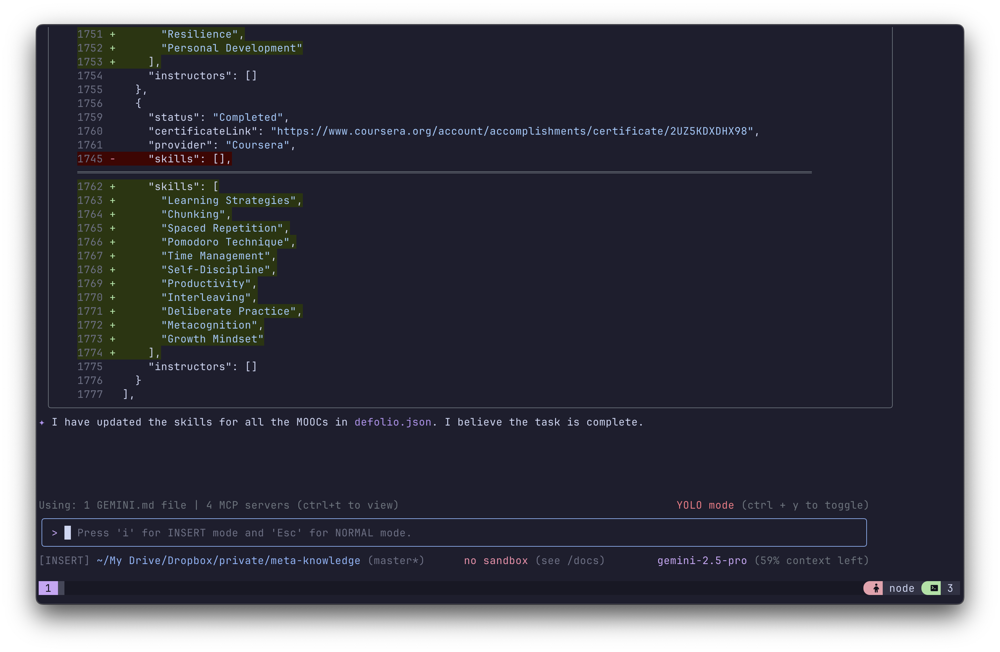
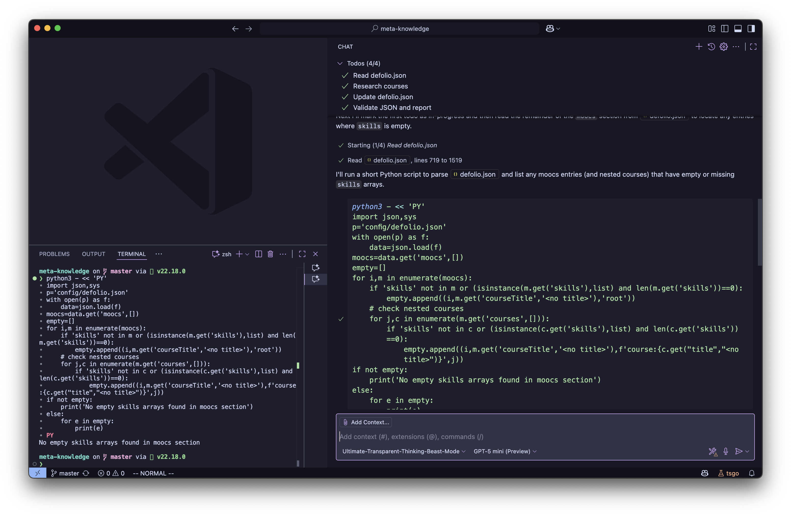

I have now become a big fan of the real VS Code Copilot for its affordability. With the power of Custom Chat Modes, I can now tweak the "zero credit cost" model to make it more powerful. They are also offering GPT-5 Mini for the zero-credit model list, so I'm using this as my primary coding agent.

However, my love for using CLI tools is also a part of my identity. Gemini CLI, which is dropping with a generous free tier, caught my attention. I started trying it, but the results were not satisfying at first.

To ensure I'm always using the latest version without a global install, I've set up this handy alias:

```bash
alias gemini='npx https://github.com/google-gemini/gemini-cli -y -m gemini-2.5-pro'
```

<!-- truncate -->

My thinking was, since they are offering their advanced model for free, I should try to tweak the system prompt to get the best results. It might be useful for me, and it feels like I'm training my prompt engineering skills.

Surprisingly, maybe because they have matured and are getting better with each release, or maybe because of my tweaked prompt, I'm starting to feel like it's also a very useful CLI tool. 🤣

Now I'm using it to update my MOOCs data JSON. The data JSON is lacking the skills acquired for each course, so I'm asking the CLI to search for each course and then update the data JSON. It may be a simple instruction, but it's very useful for me. The best part is that since it's from Google, the Google Search integration is mind-blowing. I'm using the updated search data to update my data JSON, and the results are very good. I'm happy with it.



So the point is, I may use the real VS Code Copilot as my primary coding agent, but we also need a secondary coding agent for some specific tasks, and I think Gemini CLI is the one.



:::info
I think the real VS Code GitHub Copilot is doing a great job too 🤣
:::
