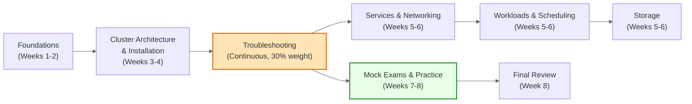

# Certified Kubernetes Administrator (CKA) Exam Prep Plan

:::info
**Note:** I haven't taken the CKA exam yet and am currently preparing for it. This plan is a work in progress and will change as I continue my studies and gain more experience.
:::

<hr/>
## 🗂️ CKA Exam Domains & Weighting

<hr/>

| Domain                                                 | Weight |
| ------------------------------------------------------ | ------ |
| **Troubleshooting**                                    | 30%    |
| **Cluster Architecture, Installation & Configuration** | 25%    |
| **Services & Networking**                              | 20%    |
| **Workloads & Scheduling**                             | 15%    |
| **Storage**                                            | 10%    |

<br/>

> 🛠️ **Note:** A significant portion of the exam is dedicated to troubleshooting, so it's crucial to be proficient in debugging cluster and application issues.

---

## 📊 Visual Study Plan

Below is a high-level study flow to help you prioritize topics and practice time. The diagram shows focus areas and recommended study order (start at "Foundations").



This visual helps emphasize that troubleshooting is continuous and should be practiced alongside each topic, not only in the later weeks.

## 🎯 Learning Resources

Here is a curated list of resources to help you prepare for the CKA exam.

:::info 🎓 Primary Learning Paths
Choose a primary learning path that best suits your style. You can mix and match, but focusing on one comprehensive resource first is often effective.
:::

:::tip 🧑‍💻 Interactive Courses with Labs

- **Certified Kubernetes Administrator (CKA) with Practice Tests (KodeKloud):** Created by Mumshad Mannambeth, this course is offered on the KodeKloud platform and is one of the most popular and highly-rated options. It includes hands-on labs for each topic and mock exams that are invaluable for preparation.
- **Kubernetes Fundamentals (LFS258):** The official course from the Linux Foundation. It provides a strong foundation in Kubernetes concepts.
  :::

:::info 📚 Books

- _The Kubernetes Book_ by Nigel Poulton: An excellent, easy-to-read book for building a solid foundational understanding of Kubernetes concepts from the ground up.
- _Kubernetes in Action_ by Marko Luksa: A comprehensive and in-depth book for those who want a deep technical understanding of how Kubernetes works under the hood.
- _Certified Kubernetes Administrator (CKA) Study Guide_ by Benjamin Muschko: Specifically tailored for the CKA exam, covering all required topics and providing practical examples that align with the exam objectives.
  :::

:::tip 🎥 YouTube Video Courses

- **Tech Tutorials with Piyush - CKA Full Course:** A comprehensive playlist specifically designed for the 2025 CKA curriculum, featuring over 40 videos with hands-on demos and assignments.
- **TechWorld with Nana - Complete Kubernetes Tutorial:** A highly-regarded, beginner-to-advanced tutorial with clear explanations and visuals.
- **freeCodeCamp.org - Kubernetes Tutorial for Beginners:** Several long-form video courses covering Kubernetes fundamentals, perfect for those new to the ecosystem.
  :::

:::info 🏫 Coursera Courses & Specializations

- **Exam Prep CKA: Certified Kubernetes Administrator (Whizlabs Instructor):** A Coursera course specifically designed to cover the CKA exam curriculum topic by topic.
- **Introduction to Containers w/ Docker, Kubernetes & OpenShift (IBM):** Great for understanding the foundational technologies that Kubernetes is built upon and interacts with.
- **Architecting with Google Kubernetes Engine (Google Cloud):** Focused on Google Cloud's implementation, but covers core Kubernetes architecture and principles in great depth.
  :::

:::tip 🌐 Community & Supplementary Resources

- **GitHub CKA Guide:** The [Cloud-Native-Islamabad/Certified-Kubernetes-Administrator-CKA-Guide-2025](https://github.com/Cloud-Native-Islamabad/Certified-Kubernetes-Administrator-CKA-Guide-2025) repository is an excellent collection of resources, links, and information.
- **Reddit:** The [r/CKAExam](https://reddit.com/r/CKAExam) and [r/kubernetes](https://reddit.com/r/kubernetes) subreddits are great places to find tips, ask questions, and learn from the experiences of others.
  :::

---

:::caution 🧑‍💻 Hands-On Practice (The Key to Success)
**Killer.sh:** The official CKA exam simulator provided by the Linux Foundation. You get two free sessions when you register for the exam. The simulator is known to be more difficult than the actual exam, so don't be discouraged if you struggle with it. It's an excellent tool for identifying your weak areas.

**Killercoda:** Offers free, interactive, browser-based Kubernetes scenarios. It's a great way to get quick hands-on practice without setting up your own environment.

**Local Kubernetes Environments:**

- **Minikube:** Run a single-node Kubernetes cluster on your local machine.
- **kubeadm:** The exam environment is built with kubeadm, so it's highly recommended to practice setting up and managing a cluster using this tool. You can use virtualization software like VirtualBox or VMware to create a multi-node cluster.
  :::

:::info 📚 Essential Documentation

- **Official Kubernetes Documentation:** Since this is the only external resource allowed during the exam, you must be proficient at navigating and searching it. Practice finding information on topics like deployments, services, networking policies, and storage.
- **Kubernetes Blog:** Also allowed during the exam, the blog can provide useful context and examples.
  :::

---

## 🗓️ 8-Week Study Plan

This is a suggested timeline. Feel free to adjust it based on your experience and schedule.

<details>
<summary><strong>Weeks 1-2: Foundations</strong></summary>

**Goal:** Understand core Kubernetes concepts.

- [ ] Go through the "Coursera Courses & Specializations" learning path
- [ ] Focus on understanding the Kubernetes architecture (control plane, worker nodes, etc.)
- [ ] Get comfortable with basic kubectl commands
- [ ] Learn about Pods, Deployments, ReplicaSets, and Services

</details>

<details>
<summary><strong>Weeks 3-4: Cluster Administration & Troubleshooting</strong></summary>

**Goal:** Tackle the two most heavily weighted domains.

- [ ] Practice installing clusters with kubeadm
- [ ] Learn how to back up and restore the etcd database
- [ ] Dive deep into troubleshooting (kubectl logs, describe, get events)
- [ ] Work through troubleshooting scenarios on Killercoda or in your own lab

</details>

<details>
<summary><strong>Weeks 5-6: Networking, Scheduling, and Storage</strong></summary>

**Goal:** Cover the remaining exam domains.

- [ ] Networking: Learn about NetworkPolicies, Ingress, Egress, and CoreDNS
- [ ] Scheduling: Understand taints, tolerations, node affinity, and anti-affinity
- [ ] Storage: Work with PersistentVolumes (PVs), PersistentVolumeClaims (PVCs), and StorageClasses

</details>

<details>
<summary><strong>Week 7: Intensive Practice & Mock Exams</strong></summary>

**Goal:** Build speed and confidence.

- [ ] Take your first Killer.sh session. Analyze your results and identify weak areas
- [ ] Redo the labs from your primary course, focusing on speed
- [ ] Practice using imperative commands (kubectl create deployment, kubectl expose, etc.) to save time

</details>

<details>
<summary><strong>Week 8: Review and Final Prep</strong></summary>

**Goal:** Consolidate your knowledge and prepare for exam day.

- [ ] Take your second Killer.sh session. You should see a significant improvement
- [ ] Review your notes, especially on your weak topics
- [ ] Familiarize yourself with the exam environment and rules
- [ ] Get a good night's sleep before the exam!

</details>

---

:::tip 🏆 Exam Tips
**Time Management:**

- [ ] The exam is fast-paced. If you're stuck on a question, flag it and come back to it later.

**kubectl Aliases:**

- [ ] Set up aliases like `alias k=kubectl` to save time.

**Context is Key:**

- [ ] Always ensure you're in the correct cluster and namespace by running `kubectl config get-contexts` and `kubectl config use-context <context_name>`.

**YAML from Scratch is a Trap:**

- [ ] Avoid writing YAML files from scratch. Use imperative commands with `--dry-run=client -o yaml` to generate the basic structure and then modify it.

**Don't Panic:**

- [ ] Stay calm and focused. If you've prepared well, you have the knowledge to pass.
      :::

---

## 🧾 Quick Cheatsheet & Exam-Day Checklist

Use this compact cheatsheet during last-week review sessions and memorize or pin the checklist for exam day.

### Kubectl quick commands

```bash
k get nodes # nodes and status
k get pods -A # all pods across namespaces
k describe pod <pod> # pod troubleshooting
k logs -f <pod> # stream logs from pod
k exec -it <pod> -- /bin/sh # run a shell inside a pod (or /bin/bash)
k apply -f <file.yaml> # apply a manifest
k create deployment <name> --image=<image> --replicas=1
k rollout status deployment/<name>
k get pvc,pv # storage objects
k get events -A # cluster events
```

Tip: create aliases in your environment (e.g., `alias k=kubectl`) and practice using `--dry-run=client -o yaml` to scaffold manifests.

### Exam-Day Checklist

- [ ] Confirm exam time, timezone, and ID documents
- [ ] Ensure a quiet, uninterrupted workspace and stable internet
- [ ] Have two forms of identification ready (as per Linux Foundation rules)
- [ ] Open the official Kubernetes docs and practice quick-searching with Ctrl+F
- [ ] Set up kubectl aliases and adjust terminal font/size for readability
- [ ] Keep an emergency plan (breaks, technical issues): contact exam support number
- [ ] Breathe and manage time: flag hard tasks and move on; return later

---

Good luck with your CKA journey!
