# Certified Kubernetes Administrator (CKA) Exam Prep Plan

:::info
**Note:** I haven't taken the CKA exam yet and am currently preparing for it. This plan is a work in progress and will change as I continue my studies and gain more experience.
:::

<hr/>
## 🗂️ CKA Exam Domains & Weighting

<hr/>

| Domain                                                 | Weight |
| ------------------------------------------------------ | ------ |
| **Troubleshooting**                                    | 30%    |
| **Cluster Architecture, Installation & Configuration** | 25%    |
| **Services & Networking**                              | 20%    |
| **Workloads & Scheduling**                             | 15%    |
| **Storage**                                            | 10%    |

<br/>

> 🛠️ **Note:** A significant portion of the exam is dedicated to troubleshooting, so it's crucial to be proficient in debugging cluster and application issues.

---

## 📊 Visual Study Plan

This diagram shows my phased approach to CKA preparation. It highlights the progression from foundational knowledge to hands-on practice and final exam simulation, emphasizing that troubleshooting and practice are continuous efforts.

```mermaid
flowchart TD
    A["Phase 1: Foundational Knowledge<br/>(Courses & Reading)"] --> B["Phase 2: Intensive Hands-On Practice<br/>(Killercoda, kubeadm)"]
    B --> C["Phase 3: Exam Simulation<br/>(Killer.sh, Mock Exams)"]
    C --> D["🏆 Final Review & Exam"]

    E["Continuous Practice<br/>(Troubleshooting & Scenarios)"]

    A --> E
    B --> E
    C --> E

    style B fill:#e6ffe6,stroke:#228b22,stroke-width:2px
    style C fill:#e6ffe6,stroke:#228b22,stroke-width:2px
    style E fill:#ffe4b5,stroke:#d2691e,stroke-width:2px
```



This visual helps emphasize that while there is a core path, continuous, hands-on practice is integrated throughout the entire learning process.

## 🎯 Learning Resources

Here is a curated list of resources to help you prepare for the CKA exam.

:::info 🎓 Primary Learning Paths
Choose a primary learning path that best suits your style. You can mix and match, but focusing on one comprehensive resource first is often effective.
:::

:::tip 🧑‍💻 Interactive Courses with Labs

- **Certified Kubernetes Administrator (CKA) with Practice Tests (KodeKloud):** Created by Mumshad Mannambeth, this course is offered on the KodeKloud platform and is one of the most popular and highly-rated options. It includes hands-on labs for each topic and mock exams that are invaluable for preparation.
- **Kubernetes Fundamentals (LFS258):** The official course from the Linux Foundation. It provides a strong foundation in Kubernetes concepts.
  :::

:::info 📚 Books

- _The Kubernetes Book_ by Nigel Poulton: An excellent, easy-to-read book for building a solid foundational understanding of Kubernetes concepts from the ground up.
- _Kubernetes in Action_ by Marko Luksa: A comprehensive and in-depth book for those who want a deep technical understanding of how Kubernetes works under the hood.
- _Certified Kubernetes Administrator (CKA) Study Guide_ by Benjamin Muschko: Specifically tailored for the CKA exam, covering all required topics and providing practical examples that align with the exam objectives.
  :::

:::tip 🎥 YouTube Video Courses

- **Tech Tutorials with Piyush - CKA Full Course:** A comprehensive playlist specifically designed for the 2025 CKA curriculum, featuring over 40 videos with hands-on demos and assignments.
- **TechWorld with Nana - Complete Kubernetes Tutorial:** A highly-regarded, beginner-to-advanced tutorial with clear explanations and visuals.
- **freeCodeCamp.org - Kubernetes Tutorial for Beginners:** Several long-form video courses covering Kubernetes fundamentals, perfect for those new to the ecosystem.
  :::

:::info 🏫 Coursera Courses & Specializations

- **Exam Prep CKA: Certified Kubernetes Administrator (Whizlabs Instructor):** A Coursera course specifically designed to cover the CKA exam curriculum topic by topic.
- **Introduction to Containers w/ Docker, Kubernetes & OpenShift (IBM):** Great for understanding the foundational technologies that Kubernetes is built upon and interacts with.
- **Architecting with Google Kubernetes Engine (Google Cloud):** Focused on Google Cloud's implementation, but covers core Kubernetes architecture and principles in great depth.
  :::

:::tip 🌐 Community & Supplementary Resources

- **GitHub CKA Guide:** The [Cloud-Native-Islamabad/Certified-Kubernetes-Administrator-CKA-Guide-2025](https://github.com/Cloud-Native-Islamabad/Certified-Kubernetes-Administrator-CKA-Guide-2025) repository is an excellent collection of resources, links, and information.
- **Reddit:** The [r/CKAExam](https://reddit.com/r/CKAExam) and [r/kubernetes](https://reddit.com/r/kubernetes) subreddits are great places to find tips, ask questions, and learn from the experiences of others.
  :::

---

:::caution 🧑‍💻 Hands-On Practice (The Key to Success)
**Killer.sh:** The official CKA exam simulator provided by the Linux Foundation. You get two free sessions when you register for the exam. The simulator is known to be more difficult than the actual exam, so don't be discouraged if you struggle with it. It's an excellent tool for identifying your weak areas.

**Killercoda:** Offers free, interactive, browser-based Kubernetes scenarios. It's a great way to get quick hands-on practice without setting up your own environment.

**Local Kubernetes Environments:**

- **Minikube:** Run a single-node Kubernetes cluster on your local machine.
- **kubeadm:** The exam environment is built with kubeadm, so it's highly recommended to practice setting up and managing a cluster using this tool. You can use virtualization software like VirtualBox or VMware to create a multi-node cluster.
  :::

:::info 📚 Essential Documentation

- **Official Kubernetes Documentation:** Since this is the only external resource allowed during the exam, you must be proficient at navigating and searching it. Practice finding information on topics like deployments, services, networking policies, and storage.
- **Kubernetes Blog:** Also allowed during the exam, the blog can provide useful context and examples.
  :::

---

## 🗓️ My CKA Study & Preparation Plan

This is my personalized study plan to prepare for the CKA exam. It's structured in phases, from foundational knowledge to intensive hands-on practice and exam simulation.

<hr/>

### Phase 1: Foundational Knowledge & Core Concepts

**Goal:** Build a strong theoretical understanding of Kubernetes architecture and objects.

:::info 📚 Courses & Note-Taking
I will complete the following courses, creating detailed distillation notes and summaries for each to reinforce my learning.
:::

- [ ] **Exam Prep CKA: Certified Kubernetes Administrator (Whizlabs Instructor):** A Coursera course specifically designed to cover the CKA exam curriculum topic by topic.
- [ ] **Introduction to Containers w/ Docker, Kubernetes & OpenShift (IBM):** Great for understanding the foundational technologies that Kubernetes is built upon and interacts with.
- [ ] **Architecting with Google Kubernetes Engine (Google Cloud):** Focused on Google Cloud's implementation, but covers core Kubernetes architecture and principles in great depth.

:::tip 🌐 Supplementary Community Resources
I will use these resources continuously throughout my study to supplement my learning and get community insights.
:::

- [ ] **GitHub CKA Guide:** The [Cloud-Native-Islamabad/Certified-Kubernetes-Administrator-CKA-Guide-2025](https://github.com/Cloud-Native-Islamabad/Certified-Kubernetes-Administrator-CKA-Guide-2025) repository is an excellent collection of resources, links, and information.
- [ ] **Reddit:** The [r/CKAExam](https://reddit.com/r/CKAExam) and [r/kubernetes](https://reddit.com/r/kubernetes) subreddits are great places to find tips, ask questions, and learn from the experiences of others.

<hr/>

### Phase 2: Deep Dive & Recommended Book

**Goal:** Solidify knowledge with a focused, exam-oriented book.

:::info 📖 Recommended Reading
For the most efficient and targeted preparation, I will focus on the following book. It is specifically tailored for the CKA exam, covering all required topics and providing practical examples that align with the exam objectives.
:::

- [ ] **Primary Book:** _Certified Kubernetes Administrator (CKA) Study Guide_ by Benjamin Muschko.
- [ ] **Action:** Read through the book, completing all examples and exercises. My distillation notes from the courses will be expanded with insights from this book.

<hr/>

### Phase 3: Intensive Hands-On Practice

**Goal:** Develop the muscle memory and practical skills required for the exam. This phase is critical and will overlap with the previous phases.

:::caution 🧑‍💻 Practice is the Key to Success
I will follow this structured approach to hands-on practice, moving from guided scenarios to a full self-managed environment.
:::

:::tip Master Imperative Commands
A critical skill for CKA is speed. I will make it a habit to **always** generate base YAML using imperative commands rather than writing from scratch. For every practice task, I will use `kubectl run/create/expose --dry-run=client -o yaml` and then modify the output. This builds muscle memory and drastically reduces errors.
:::

1.  **Browser-Based Scenarios (Low Friction Start):**
    - **Tool:** [**Killercoda**](https://killercoda.com/playgrounds/scenario/kubernetes)
    - **Plan:**
      - [ ] Complete a wide variety of scenarios, especially those focused on troubleshooting, networking, and storage.
      - [ ] Use this platform for quick, topic-specific practice without the overhead of setting up a local cluster.

2.  **Local Cluster Administration (Realistic Environment):**
    - **Tool:** [**kubeadm**](https://kubernetes.io/docs/setup/production-environment/tools/kubeadm/)
    - **Plan:**
      - [ ] Set up a multi-node (1 control-plane, 2 workers) cluster locally using VirtualBox or similar virtualization software.
      - [ ] Practice the entire cluster lifecycle: installation, configuration, upgrading, and teardown.
      - [ ] Manually perform backup and restore operations on the `etcd` database.
      - [ ] Simulate node failures and practice recovery procedures. This is crucial because the exam environment is `kubeadm`-based.

3.  **Simulate & Fix Common Failures (Chaos Practice):**
    - **Plan:** I will deliberately introduce and then troubleshoot common, real-world problems in my local `kubeadm` cluster. This will build critical diagnostic skills.
      - [ ] Pods in `ImagePullBackOff` or `CrashLoopBackOff`.
      - [ ] Service and Pod `selector` mismatches.
      - [ ] `NetworkPolicy` blocking legitimate traffic.
      - [ ] Pods failing to schedule due to taints or resource limits.
      - [ ] Nodes entering a `NotReady` state.

<hr/>

### Phase 4: Exam Simulation & Final Preparation

**Goal:** Build speed, accuracy, and confidence under exam conditions.

:::tip 🎯 Practice Exams & Scenarios
I will use a combination of mock exams and the official simulator to be fully prepared for the exam's pace and difficulty.
:::

1.  **Continuous Mock Exams:**
    - **Source:** The practice exams included with my primary course (e.g., Whizlabs on Coursera).
    - **Plan:**
      - [ ] Take a practice exam after completing each major domain to benchmark my understanding.
      - [ ] In the final weeks, retake all practice exams, focusing on improving speed and accuracy.

2.  **Official CKA Exam Simulator (The Real Test):**
    - **Tool:** [**Killer.sh**](https://killer.sh/)
    - **Plan:** The CKA exam registration includes two free sessions. I will use them strategically:
      - [ ] **Session 1 (Mid-Preparation):** Take the first session about 3-4 weeks before the exam. The goal is not to score perfectly, but to identify my weakest areas under pressure. The simulator is harder than the real exam, so this will be a humbling but essential learning experience.
      - [ ] **Session 2 (Final Week):** Take the second session 3-5 days before the exam. This will be a final dress rehearsal. I will focus on time management, navigating the Kubernetes documentation efficiently, and solidifying my command-line aliases and shortcuts.

3.  **Sharpen Exam-Day Skills:**
    - **Plan:** I will focus on skills that are crucial for speed and accuracy under pressure.
      - [ ] **Timed Scenarios:** I will start timing my practice labs to get a feel for the exam's pace.
      - [ ] **Documentation Navigation Drills:** I will regularly practice finding information in the official Kubernetes docs. For example, I'll start a timer and find the YAML for a specific object (like a `PersistentVolume` with a specific `accessMode`) using only the docs search.

---

:::tip 🏆 Exam Tips
**Time Management:**

- [ ] The exam is fast-paced. If you're stuck on a question, flag it and come back to it later.

**kubectl Aliases:**

- [ ] Set up aliases like `alias k=kubectl` to save time.

**Context is Key:**

- [ ] Always ensure you're in the correct cluster and namespace by running `kubectl config get-contexts` and `kubectl config use-context <context_name>`.

**YAML from Scratch is a Trap:**

- [ ] Avoid writing YAML files from scratch. Use imperative commands with `--dry-run=client -o yaml` to generate the basic structure and then modify it.

**Don't Panic:**

- [ ] Stay calm and focused. If you've prepared well, you have the knowledge to pass.
      :::

---

## 🧾 Quick Cheatsheet & Exam-Day Checklist

Use this compact cheatsheet during last-week review sessions and memorize or pin the checklist for exam day.

### Kubectl quick commands

```bash
k get nodes # nodes and status
k get pods -A # all pods across namespaces
k describe pod <pod> # pod troubleshooting
k logs -f <pod> # stream logs from pod
k exec -it <pod> -- /bin/sh # run a shell inside a pod (or /bin/bash)
k apply -f <file.yaml> # apply a manifest
k create deployment <name> --image=<image> --replicas=1
k rollout status deployment/<name>
k get pvc,pv # storage objects
k get events -A # cluster events
```

Tip: create aliases in your environment (e.g., `alias k=kubectl`) and practice using `--dry-run=client -o yaml` to scaffold manifests.

### Exam-Day Checklist

- [ ] Confirm exam time, timezone, and ID documents
- [ ] Ensure a quiet, uninterrupted workspace and stable internet
- [ ] Have two forms of identification ready (as per Linux Foundation rules)
- [ ] Open the official Kubernetes docs and practice quick-searching with Ctrl+F
- [ ] Set up kubectl aliases and adjust terminal font/size for readability
- [ ] Keep an emergency plan (breaks, technical issues): contact exam support number
- [ ] Breathe and manage time: flag hard tasks and move on; return later

---

Good luck with your CKA journey!
