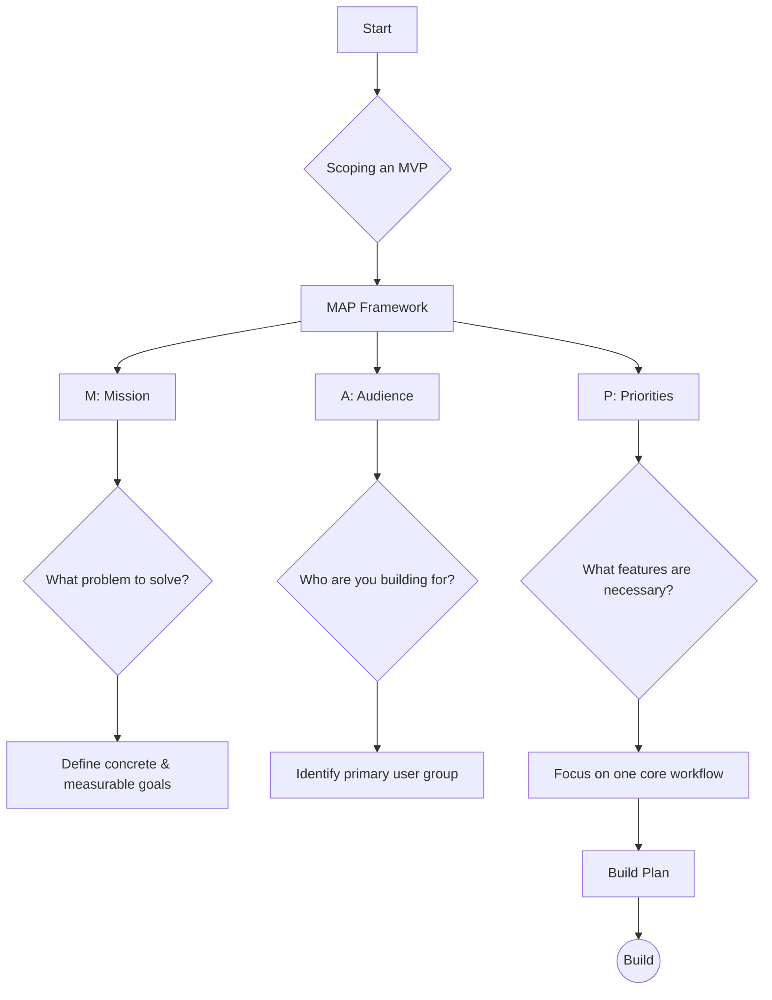

# Scoping an MVP

The Minimum Viable Product (MVP) is the smallest version of your idea that still solves a real problem. The MVP framework helps you build smarter, not harder, by focusing on learning quickly. The development cycle is: Plan, Build, Test, Learn, Improve, and Repeat.

To define your MVP, you can use the MAP framework: Mission, Audience, and Priorities.

## MAP Framework

### M: Mission

- **What is your end goal?**
- Identify a specific pain point or inefficiency.
- Your goal should be concrete and measurable.
- Define success metrics to know if the problem is solved.

### A: Audience

- **Who are you building for?**
- You can't build for everyone, so identify your primary user group.
- Consider their technical expertise, frustrations with existing solutions, and how they measure success.

### P: Priorities

- **What features are absolutely necessary?**
- Focus on one core workflow.
- Identify the most critical feature to test if your idea works.
- Create a development roadmap by prioritizing must-have features.

## Real-World Examples

### Example 1: Meal-Kit Delivery Service

- **Mission:** Reduce the time and effort people spend on meal planning and grocery shopping. Success metric: 50% of users order at least once a week.
- **Audience:** Busy professionals and parents who want to eat healthy but don't have time to cook from scratch. They are comfortable with online services.
- **Priorities:**
  - **Must-have:** A simple web interface to view a weekly menu, select meals, and place an order. Secure payment processing.
  - **Nice-to-have:** Mobile app, ability to customize meals, different dietary plans.
  - **Next version:** Subscription model, loyalty program, integration with fitness apps.

### Example 2: Language Learning App

- **Mission:** Help users learn basic conversational phrases in a new language for an upcoming trip. Success metric: 80% of users complete the "basic conversation" module.
- **Audience:** Travelers who want to learn a few key phrases before a trip. They are not looking for fluency.
- **Priorities:**
  - **Must-have:** A set of flashcards with audio for basic phrases (greetings, ordering food, asking for directions). A simple quiz to test knowledge.
  - **Nice-to-have:** Gamification elements (points, streaks), voice recognition for pronunciation practice.
  - **Next version:** More languages, advanced grammar lessons, chatbot for conversation practice.

## Mermaid Diagram: MAP Framework

