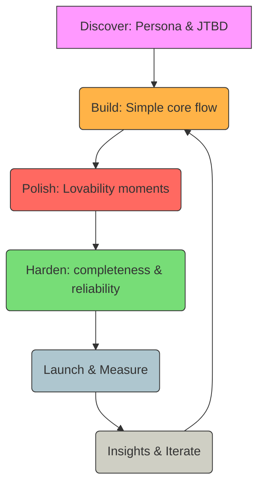

# SLC Framework — Simple, Lovable, Complete

> The SLC framework is a product-development approach that complements the Minimum Viable Product (MVP) idea by emphasizing a product that is Simple, Lovable, and Complete within a narrow scope.

---

## Definitions

- Simple — Focus on a single persona and one job-to-be-done (JTBD). Deliver the minimum set of features required to achieve a clear success outcome for that persona. Prioritize clarity, discoverability, and the happy path.

- Lovable — Add small, high-impact UX details (polish, microcopy, delightful interaction) aimed at creating a positive emotional connection. Choose 1–3 moments in the flow for targeted delight.

- Complete — Ensure the experience feels finished for the selected scope: robust happy path, common error handling, basic accessibility, reasonable performance, and clear documentation of what's out-of-scope.

## How SLC relates to MVP and related concepts

- MVP (Minimum Viable Product): a product with just enough features to be usable by early customers who can then provide feedback for future development. MVPs emphasize validated learning and fast iteration. (See: Wikipedia — Minimum viable product)

- MLP (Minimum Lovable Product): a close cousin to SLC; emphasizes that the initial offering should be lovable, not merely viable.

- SLC differs from a bare MVP by requiring a finished-feeling, polished experience inside a narrow scope so early users have a positive impression and are more likely to remain and evangelize.

## Practical SLC checklist (brief)

1. Specify the target persona and JTBD.
2. Define the activation event and one or two measurable success metrics.
3. Map the core flow; remove non-essential steps.
4. Choose 1–3 lovability items (microcopy, micro-interaction, onboarding touch).
5. Implement happy-path and common error handling, basic accessibility, and minimal analytics for the core metrics.
6. Dogfood internally; run 5–10 quick user interviews before public release.
7. Document out-of-scope items and the intended expansion plan.

## Example scenarios (concrete)

- Productivity app: focus on single task creation → reminder → completion flow; include a satisfying completion animation and polished onboarding copy; ensure offline and sync for core tasks.
- Marketplace: support one category end-to-end (listing → purchase → confirmation); make payments frictionless and provide friendly post-purchase messaging and support contact.

## Metrics to measure success

- Activation rate (users who complete the activation event).
- Retention (D1, D7 for activated users).
- Task success rate and time-to-success.
- NPS / qualitative sentiment from short surveys.
- Conversion to paid or other monetization signals (if applicable).

## Risks and trade-offs

- More polish increases time-to-launch; balance polish vs learning speed.
- Lovability can overfit to early users if persona selection is poor.
- Narrow scope may require careful planning for future expansions.

## Mermaid diagram (SLC pipeline)

The diagram below shows a simple pipeline: Discover → Build (Simple) → Polish (Lovable) → Harden (Complete) → Measure → Iterate.

## References & authoritative sources

- Minimum viable product — Wikipedia: https://en.wikipedia.org/wiki/Minimum_viable_product
- Jobs-to-be-Done — Wikipedia: https://en.wikipedia.org/wiki/Job_to_be_done (JTBD is a product discovery framework; seek original sources by Christensen, Ulwick, and others for deeper reading)
- Net Promoter Score (NPS) — Wikipedia: https://en.wikipedia.org/wiki/Net_Promoter
