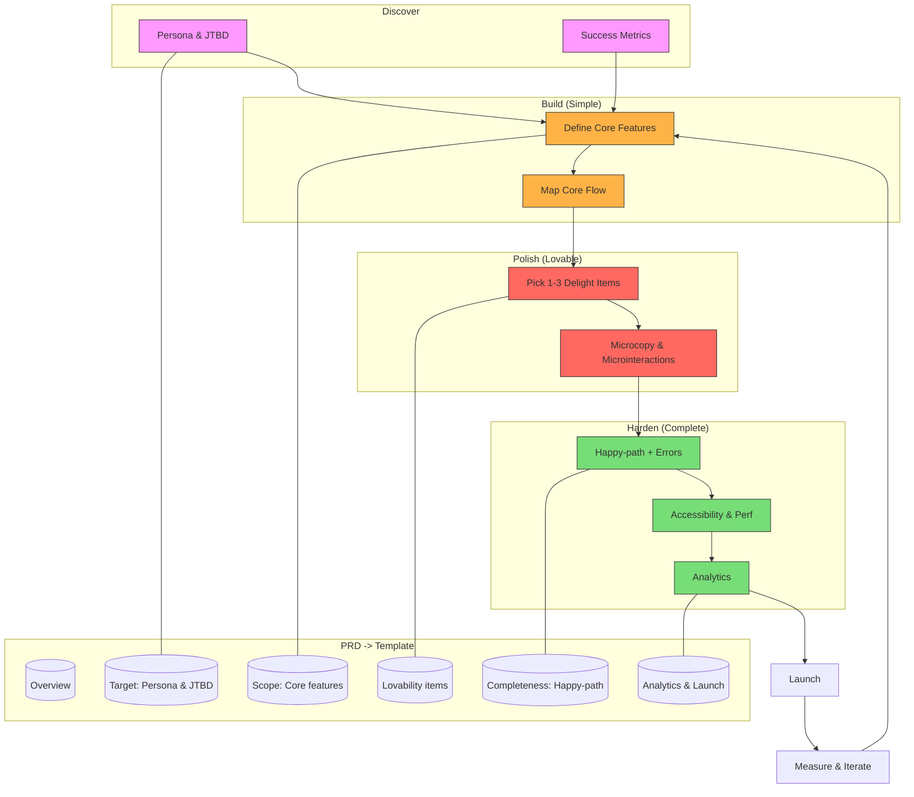

# SLC — Simple, Lovable, Complete (Consolidated)

This single-note summary consolidates the SLC framework, a compact PRD template, and a marketplace example into an easy-to-read reference with a visual Mermaid diagram.

## Core idea

- Simple: narrow scope, single persona, one JTBD, minimal features that deliver a clear success outcome.
- Lovable: 1–3 high-impact UX details that create an emotional connection.
- Complete: polished happy path, basic error handling, accessibility, performance, and clear out-of-scope documentation.

## Quick checklist (SLC launch readiness)

1. Define Persona & JTBD (one persona only)
2. Specify activation event and 1–2 success metrics
3. Map the core happy-path flow and remove non-essential steps
4. Pick 1–3 lovability items (microcopy, micro-interaction, onboarding)
5. Implement happy-path + common errors + basic accessibility
6. Instrument 5–8 analytics events for activation and errors
7. Dogfood, run 5–10 quick interviews, close beta, then launch

## Minimal SLC PRD (fill-in template)

- Project name:
- Date:
- Owner / PM:
- Team:

- Persona (1):
  - Short bio / context:
  - JTBD: "When [situation], I want to [motivation], so I can [outcome]."

- Success metric(s):
  - Primary activation event (e.g., purchase completed within 3 minutes)
  - Secondary metrics: retention, repeat action, time-to-success

- Scope (Simple - what's IN): list 3 core features that achieve the activation
- Out-of-scope: explicitly call out what you won't build

- Lovability (1–3 items): describe the delight + rough effort

- Completeness & reliability: happy-path acceptance criteria (3 steps), error messages, accessibility baseline, perf targets

- Analytics: event names, dashboards, feedback plan (post-launch NPS/email)

- Launch: dogfood, beta plan (size + duration), public launch checklist

## Example: One-Category Marketplace (SLC)

- Persona: Casual buyer for a single curated category (e.g., handmade goods)
- JTBD: Find a trustworthy listing and buy with minimal friction
  - Primary activation: User completes first purchase quickly (target: &lt;3 min)

Core features (Simple):

1. Curated listing page
2. Product detail + buy button
3. One-page checkout (guest + saved card)

Lovability picks:

- High-quality photo template
- Friendly post-purchase email + order-tracking stub

Completeness: happy-path flows, payment failure messaging, accessible product cards, listing page load &lt;2s

Analytics: listing_viewed, product_viewed, checkout_started, purchase_completed, payment_failed

Launch plan: dogfood, 200-user beta, monitor checkout funnel & payment failure rate

> Example: A completed PRD for this marketplace is available: [One-Category Marketplace — Complete PRD](./slc-prd-marketplace-complete.md)

## Mermaid diagram — SLC flow and how PRD pieces map

## How to use this note

- Use the checklist as a pre-launch rubric.
- Copy the Minimal SLC PRD into your project board or Google Doc and fill the blanks.
- Use the Mermaid diagram to explain SLC to stakeholders quickly.

## References

- See full SLC Framework note and PRD template in this folder for detailed guidance and examples.
