# The Solopreneur's Journey: From Idea to Impact

A solopreneur is an entrepreneur who builds and runs a business single-handedly. This path is defined by autonomy, agility, and a direct connection to your customers. This guide outlines the essential knowledge and steps to become a successful solopreneur.

## 1. The Solopreneur Mindset

Before diving into business mechanics, cultivating the right mindset is critical.

- **Discipline & Self-Motivation:** You are your own boss. This requires a strong work ethic and the ability to manage your time and energy without external pressure.
- **Resilience & Adaptability:** You will face setbacks. The ability to learn from failures, pivot when necessary, and stay persistent is non-negotiable.
- **Growth Orientation:** You must be a perpetual learner, constantly acquiring new skills in areas like marketing, sales, and finance.
- **Customer-Centricity:** Your success is directly tied to the value you provide. Obsess over understanding and solving your customers' problems.

## 2. The Roadmap to Becoming a Solopreneur

This journey can be visualized as a cycle of building, measuring, and learning.

```mermaid
graph TD
    subgraph "Phase 1: Foundation"
        A[💡 Idea & Niche] --> B{🤔 Market Validation};
        B --> C[📝 Lean Business Plan];
        C --> D[⚖️ Legal & Financial Setup];
    end

    subgraph "Phase 2: Build & Launch"
        D --> E[🚀 Build MVP/Service];
        E --> F[🌐 Branding & Online Presence];
        F --> G[📢 Launch & Initial Marketing];
    end

    subgraph "Phase 3: Growth & Scaling"
        G --> H[📈 Marketing & Sales Engine];
        H --> I[👂 Customer Feedback Loop];
        I --> J[🤖 Automate & Systematize];
        J --> K[🔄 Refine & Scale];
    end

    I --> E;
    K --> H;

    style A fill:#f9f,stroke:#333,stroke-width:2px
    style E fill:#ffb347,stroke:#333,stroke-width:2px
    style H fill:#77dd77,stroke:#333,stroke-width:2px
```

### Phase 1: Foundation

1.  **Find Your Niche:**
    - **Passion & Skill Intersection:** What are you good at? What do you enjoy?
    - **Market Need:** Is there a group of people willing to pay for a solution to a problem you can solve?
    - **Focus:** Start narrow. It's better to be a big fish in a small pond.

2.  **Validate Your Idea:**
    - **Talk to Potential Customers:** Don't build in a vacuum. Conduct interviews, run surveys.
    - **Create a Landing Page:** Build a simple "coming soon" page to gauge interest and collect emails.
    - **Analyze Competitors:** Understand what others are doing, what they charge, and where the gaps are.

3.  **Create a Lean Business Plan:**
    - This isn't a 50-page document. A one-page Lean Canvas is perfect.
    - **Key Components:** Problem, Solution, Key Metrics, Unique Value Proposition, Customer Segments, Channels, Cost Structure, and Revenue Streams.

4.  **Legal & Financial Setup:**
    - **Business Structure:** Decide between Sole Proprietorship, LLC, etc. (Consult a professional).
    - **Separate Finances:** Open a dedicated business bank account.
    - **Basic Accounting:** Use software like Wave, QuickBooks, or a simple spreadsheet to track income and expenses from day one.

### Phase 2: Build & Launch

5.  **Build Your MVP (Minimum Viable Product/Service):**
    - **Product:** Build only the core features needed to solve the primary problem.
    - **Service:** Define a clear, concise service offering. Create a portfolio or case studies.

6.  **Establish Your Brand & Online Presence:**
    - **Name & Logo:** Keep it simple and memorable.
    - **Website/Portfolio:** Your digital storefront. It should clearly state who you help and how.
    - **Social Media:** Choose 1-2 platforms where your target audience spends their time.

7.  **Launch:**
    - "Launch" is a process, not an event.
    - **Initial Push:** Announce it to your network, email list, and on your chosen social channels.
    - **Seek First Customers:** Offer an early-bird discount or free consultations to get initial traction and testimonials.

### Phase 3: Growth & Scaling

8.  **Build a Marketing & Sales Engine:**
    - **Content Marketing:** Create valuable content (blog posts, videos, newsletters) that helps your target audience.
    - **Direct Outreach:** If applicable, identify and connect with potential clients.
    - **Sales Process:** Define your process from lead to closing a sale. Keep it simple and repeatable.

9.  **Create a Feedback Loop:**
    - Actively solicit feedback from every customer.
    - Use this feedback to iterate on your product/service. This is your biggest competitive advantage.

10. **Automate and Systematize:**
    - Identify repetitive tasks (e.g., scheduling, invoicing, email responses).
    - Use tools (like Zapier, Calendly, Stripe) to automate them.
    - Document your processes so you can eventually outsource tasks if you choose to scale further.

## 3. Essential Toolkit for Solopreneurs

- **Project Management:** Trello, Asana, Notion
- **Finance & Invoicing:** Stripe, Wave, QuickBooks
- **Marketing & Website:** Carrd (for landing pages), Webflow, Ghost (for blogs/newsletters)
- **Scheduling:** Calendly
- **Automation:** Zapier

Being a solopreneur is a marathon, not a sprint. Focus on providing massive value to a specific group of people, and build your business one brick at a time.
